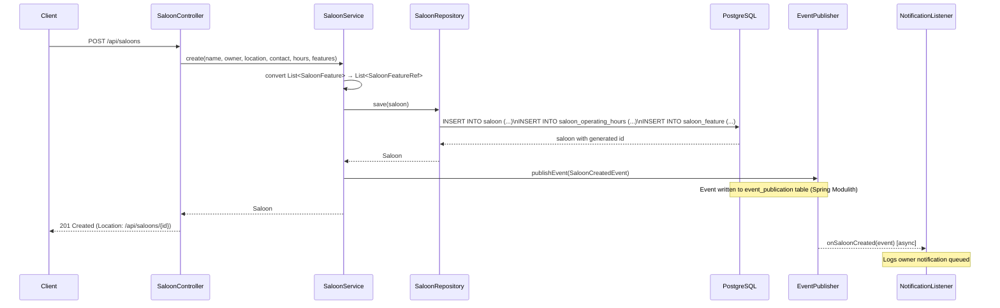
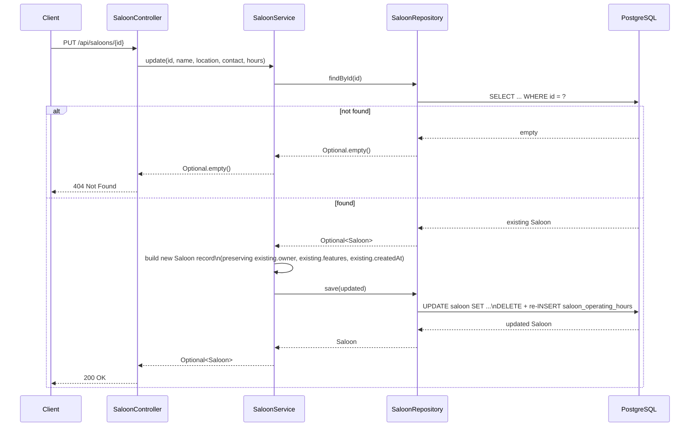
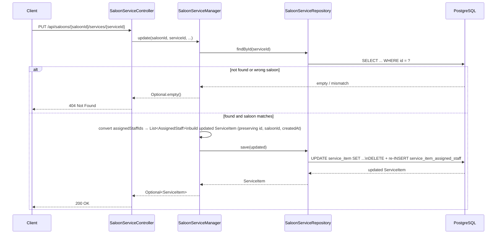
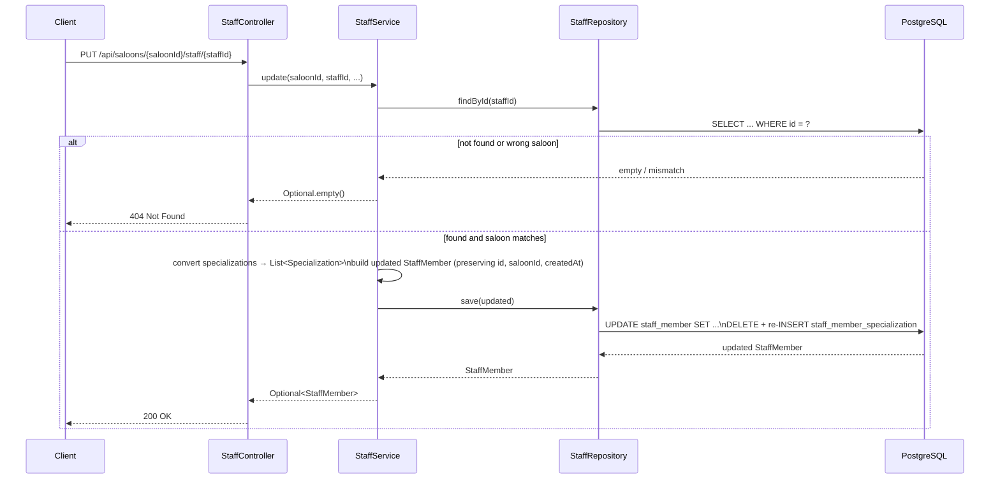

# API Reference

Base path: `/api`

All request and response bodies are `application/json`. IDs are `Long` integers.

---

## Saloons

### Create a saloon

`POST /api/saloons`

**Request**

```json
{
  "name": "Glam Saloon",
  "ownerName": "Jane Doe",
  "ownerEmail": "jane@glamsaloon.com",
  "ownerPhone": "+1234567890",
  "location": {
    "address": "123 Main St",
    "city": "New York",
    "state": "NY",
    "country": "USA",
    "zipCode": "10001"
  },
  "contact": {
    "phone": "+1234567890",
    "email": "info@glamsaloon.com",
    "website": "https://glamsaloon.com"
  },
  "operatingHours": [
    { "day": "MONDAY", "openTime": "09:00", "closeTime": "18:00", "closed": false },
    { "day": "SUNDAY", "openTime": null, "closeTime": null, "closed": true }
  ],
  "features": ["BOOKING", "STATIC_WEBSITE"]
}
```

| Field | Type | Required | Notes |
|---|---|---|---|
| `name` | string | yes | |
| `ownerName` | string | no | |
| `ownerEmail` | string | no | |
| `ownerPhone` | string | no | |
| `location` | object | no | See [Location](#location) |
| `contact` | object | no | See [ContactInfo](#contactinfo) |
| `operatingHours` | array | no | See [OperatingHours](#operatinghours) |
| `features` | array | no | See [SaloonFeature](#saloonfeature) values |

**Response** `201 Created`

`Location` header points to the new resource, e.g. `/api/saloons/1`.

```json
{
  "id": 1,
  "name": "Glam Saloon",
  "owner": {
    "name": "Jane Doe",
    "email": "jane@glamsaloon.com",
    "phone": "+1234567890"
  },
  "location": {
    "address": "123 Main St",
    "city": "New York",
    "state": "NY",
    "country": "USA",
    "zipCode": "10001"
  },
  "contact": {
    "phone": "+1234567890",
    "email": "info@glamsaloon.com",
    "website": "https://glamsaloon.com"
  },
  "operatingHours": [
    { "day": "MONDAY", "openTime": "09:00", "closeTime": "18:00", "closed": false },
    { "day": "SUNDAY", "openTime": null, "closeTime": null, "closed": true }
  ],
  "features": ["BOOKING", "STATIC_WEBSITE"],
  "createdAt": "2026-07-08T10:00:00Z"
}
```

**Flow**



**Plain text flow**

1. `SaloonController` (`saloon.internal`) receives the request and deserializes it into `CreateSaloonRequest` — an inner record defined inside `SaloonController` with flat owner fields (`ownerName`, `ownerEmail`, `ownerPhone`) alongside `Saloon.Location`, `Saloon.ContactInfo`, `List<Saloon.OperatingHours>`, and `List<SaloonFeature>`. `SaloonController.create()` constructs a `Saloon.Owner` record from those flat fields, then calls `SaloonService.create()`.
2. `SaloonService.create()` is annotated `@Transactional`. It converts `List<SaloonFeature>` → `List<Saloon.SaloonFeatureRef>` via a stream map. `SaloonFeatureRef` is a single-field wrapper record required by Spring Data JDBC for `@MappedCollection` persistence; its `@JsonValue` annotation makes it serialize back to a plain JSON string.
3. A new `Saloon` aggregate record is built with `id = null` and `createdAt = Instant.now()`, then passed to `SaloonRepository.save()`.
4. `SaloonRepository` (extends `ListCrudRepository<Saloon, Long>`) issues `INSERT INTO saloon`, followed by inserts into `saloon_operating_hours` (one row per `Saloon.OperatingHours`, with an auto-managed `saloon_key` ordering column) and `saloon_feature` (one row per `Saloon.SaloonFeatureRef`). All three inserts happen in the same aggregate write.
5. Still within the same `@Transactional` boundary, `SaloonService` calls `ApplicationEventPublisher.publishEvent()` with a `SaloonCreatedEvent` record (public API of the `saloon` module). Spring Modulith intercepts this call and persists the event to the `event_publication` table before the transaction commits — guaranteeing at-least-once delivery even on crash.
6. `SaloonController` receives the saved `Saloon`, builds the `Location` URI using `ServletUriComponentsBuilder.fromCurrentRequest().path("/{id}").buildAndExpand(saloon.id())`, and returns `201 Created` with the full saloon body.
7. After the transaction commits, Spring Modulith delivers `SaloonCreatedEvent` asynchronously to `SaloonNotificationListener.onSaloonCreated()` (`notification.internal`). This listener is annotated `@ApplicationModuleListener`, which enforces module boundary isolation — the `notification` module depends only on the shared `SaloonCreatedEvent` record, never on any internal `saloon` class.

---

### List all saloons

`GET /api/saloons`

**Response** `200 OK`

```json
[
  {
    "id": 1,
    "name": "Glam Saloon",
    "owner": { "name": "Jane Doe", "email": "jane@glamsaloon.com", "phone": "+1234567890" },
    "location": { "address": "123 Main St", "city": "New York", "state": "NY", "country": "USA", "zipCode": "10001" },
    "contact": { "phone": "+1234567890", "email": "info@glamsaloon.com", "website": "https://glamsaloon.com" },
    "operatingHours": [],
    "features": ["BOOKING"],
    "createdAt": "2026-07-08T10:00:00Z"
  }
]
```

**Flow**

1. `SaloonController.findAll()` delegates to `SaloonService.findAll()`.
2. `SaloonService.findAll()` calls `SaloonRepository.findAll()`, which issues `SELECT * FROM saloon` and for each row fetches the related child rows from `saloon_operating_hours` (mapped to `List<Saloon.OperatingHours>`) and `saloon_feature` (mapped to `List<Saloon.SaloonFeatureRef>`). The `@Embedded` columns (`owner_name`, `owner_email`, `owner_phone`, `address`, `city`, etc.) are hydrated directly into the nested `Saloon.Owner`, `Saloon.Location`, and `Saloon.ContactInfo` records.
3. `SaloonController` returns the resulting `List<Saloon>` as a JSON array. Returns an empty array (`[]`) when no saloons exist.

---

### Get a saloon

`GET /api/saloons/{id}`

**Response** `200 OK` — saloon object (same shape as create response)

**Response** `404 Not Found` — if the ID does not exist

**Flow**

1. `SaloonController.findById()` receives the `{id}` path variable as a `Long` and delegates to `SaloonService.findById(id)`.
2. `SaloonService.findById()` calls `SaloonRepository.findById(id)`, which queries `SELECT * FROM saloon WHERE id = ?` and fetches the aggregate's child collections.
3. The repository returns an `Optional<Saloon>`. `SaloonController` maps a present value to `200 OK` with the saloon body, or returns `ResponseEntity.notFound().build()` (`404`) if the `Optional` is empty.

---

### Update a saloon

`PUT /api/saloons/{id}`

Updates name, location, contact, and operating hours. Owner and features are preserved from the existing record.

**Request**

```json
{
  "name": "Glam Saloon Uptown",
  "location": {
    "address": "456 Park Ave",
    "city": "New York",
    "state": "NY",
    "country": "USA",
    "zipCode": "10022"
  },
  "contact": {
    "phone": "+1987654321",
    "email": "uptown@glamsaloon.com",
    "website": "https://glamsaloon.com/uptown"
  },
  "operatingHours": [
    { "day": "MONDAY", "openTime": "10:00", "closeTime": "20:00", "closed": false }
  ]
}
```

**Response** `200 OK` — updated saloon object

**Response** `404 Not Found`

**Flow**



**Plain text flow**

1. `SaloonController.update()` deserializes the body into `UpdateSaloonRequest` — an inner record inside `SaloonController` carrying `name` (String), `location` (`Saloon.Location`), `contact` (`Saloon.ContactInfo`), and `operatingHours` (`List<Saloon.OperatingHours>`). It calls `SaloonService.update(id, name, location, contact, operatingHours)`.
2. `SaloonService.update()` calls `SaloonRepository.findById(id)`. If the returned `Optional<Saloon>` is empty, the method returns `Optional.empty()` immediately; `SaloonController` maps this to `404 Not Found`.
3. When the saloon is found, `SaloonService` constructs a new `Saloon` record (all fields are final — Java record) preserving immutable fields: `existing.id()`, `existing.owner()`, `existing.features()`, and `existing.createdAt()`. Only `name`, `location`, `contact`, and `operatingHours` are replaced with the request values.
4. `SaloonRepository.save(updated)` issues `UPDATE saloon SET name = ?, address = ?, ...` for the root row, then executes `DELETE FROM saloon_operating_hours WHERE saloon_id = ?` followed by fresh inserts for the new hours. The `saloon_feature` table is not touched because the feature list is copied from the existing record. Spring Data JDBC performs this full aggregate replacement automatically.
5. `SaloonController` maps the `Optional<Saloon>` to `ResponseEntity.ok(saloon)` (`200`) or `ResponseEntity.notFound().build()` (`404`).

---

### Update features

`PUT /api/saloons/{id}/features`

Replaces the full feature list for a saloon.

**Request**

```json
{
  "features": ["BOOKING", "MEMBERSHIP", "WEBSHOP"]
}
```

**Response** `200 OK` — updated saloon object

**Response** `404 Not Found`

**Flow**

1. `SaloonController.updateFeatures()` deserializes the body into `UpdateFeaturesRequest` — an inner record inside `SaloonController` holding `List<SaloonFeature>`. It calls `SaloonService.updateFeatures(id, features)`.
2. `SaloonService.updateFeatures()` calls `SaloonRepository.findById(id)`. If the `Optional<Saloon>` is empty, returns `Optional.empty()` and the controller responds with `404`.
3. The incoming `List<SaloonFeature>` (enum values) is stream-mapped to `List<Saloon.SaloonFeatureRef>` — each `SaloonFeatureRef` is a single-field wrapper record annotated `@Table("saloon_feature")`. Its `@JsonValue` on the `feature()` accessor makes the list serialize as a plain `["BOOKING", "MEMBERSHIP"]` array rather than `[{"feature":"BOOKING"}]`.
4. A new `Saloon` record is constructed preserving `existing.id()`, `existing.name()`, `existing.owner()`, `existing.location()`, `existing.contact()`, `existing.operatingHours()`, and `existing.createdAt()` — only `features` is replaced.
5. `SaloonRepository.save(updated)` issues `DELETE FROM saloon_feature WHERE saloon_id = ?` then re-inserts the new feature rows. No other tables are modified.
6. `SaloonController` returns `200 OK` with the updated saloon body.

---

### Delete a saloon

`DELETE /api/saloons/{id}`

**Response** `204 No Content`

**Flow**

1. `SaloonController.delete()` receives the `{id}` path variable as a `Long` and calls `SaloonService.delete(id)`.
2. `SaloonService.delete()` calls `SaloonRepository.deleteById(id)`, which issues `DELETE FROM saloon WHERE id = ?`.
3. The `ON DELETE CASCADE` constraints on `saloon_operating_hours.saloon_id`, `saloon_feature.saloon_id`, `service_item.saloon_id`, and `staff_member.saloon_id` cause the database to automatically remove all child rows for that saloon.
4. `SaloonController` always returns `ResponseEntity.noContent().build()` (`204`), even if the ID did not exist — `deleteById` is a no-op on a missing record.

---

## Services

Services are scoped to a saloon via the path. A service can only be retrieved, updated, or deleted through its owning saloon.

### List services

`GET /api/saloons/{saloonId}/services`

**Response** `200 OK`

```json
[
  {
    "id": 1,
    "saloonId": 1,
    "name": "Classic Haircut",
    "description": "Shampoo, cut, and blow-dry",
    "price": 35.00,
    "currency": "USD",
    "durationMinutes": 45,
    "category": "HAIR",
    "active": true,
    "assignedStaffIds": ["1", "2"],
    "createdAt": "2026-07-08T10:00:00Z"
  }
]
```

**Flow**

1. `SaloonServiceController.findAll()` receives `{saloonId}` as a `Long` path variable and calls `SaloonServiceManager.findBySaloonId(saloonId)`.
2. `SaloonServiceManager.findBySaloonId()` delegates to `SaloonServiceRepository.findBySaloonId(saloonId)` — a derived query method on `ListCrudRepository<ServiceItem, Long>` that issues `SELECT * FROM service_item WHERE saloon_id = ?`. For each `ServiceItem`, Spring Data JDBC also fetches its assigned staff from `service_item_assigned_staff` into `List<ServiceItem.AssignedStaff>`. The `@JsonValue` on `AssignedStaff.staffId()` causes the list to serialize as `["1", "2"]`.
3. Returns the list directly; empty array if the saloon has no services.

---

### Add a service

`POST /api/saloons/{saloonId}/services`

**Request**

```json
{
  "name": "Classic Haircut",
  "description": "Shampoo, cut, and blow-dry",
  "price": 35.00,
  "currency": "USD",
  "durationMinutes": 45,
  "category": "HAIR",
  "assignedStaffIds": ["1", "2"]
}
```

| Field | Type | Required | Notes |
|---|---|---|---|
| `name` | string | yes | |
| `description` | string | no | |
| `price` | decimal | no | |
| `currency` | string | no | ISO 4217, e.g. `"USD"` |
| `durationMinutes` | int | no | |
| `category` | string | yes | See [ServiceCategory](#servicecategory) values |
| `assignedStaffIds` | array | no | IDs of staff members to assign |

**Response** `201 Created`

`Location` header points to the new resource, e.g. `/api/saloons/1/services/1`.

```json
{
  "id": 1,
  "saloonId": 1,
  "name": "Classic Haircut",
  "description": "Shampoo, cut, and blow-dry",
  "price": 35.00,
  "currency": "USD",
  "durationMinutes": 45,
  "category": "HAIR",
  "active": true,
  "assignedStaffIds": ["1", "2"],
  "createdAt": "2026-07-08T10:00:00Z"
}
```

**Flow**

1. `SaloonServiceController.add()` deserializes the body into `AddServiceRequest` — an inner record inside `SaloonServiceController` — and calls `SaloonServiceManager.add(saloonId, name, description, price, currency, durationMinutes, category, assignedStaffIds)`.
2. `SaloonServiceManager.add()` converts `List<String> assignedStaffIds` → `List<ServiceItem.AssignedStaff>` via a stream map. `AssignedStaff` is a single-field wrapper record annotated `@Table("service_item_assigned_staff")` with `@JsonValue` on its `staffId()` accessor so it round-trips as plain strings.
3. A `ServiceItem` record is built with `id = null`, `active = true`, and `createdAt = Instant.now()`, then passed to `SaloonServiceRepository.save()`.
4. `SaloonServiceRepository.save()` issues `INSERT INTO service_item` followed by inserts into `service_item_assigned_staff` (one row per `AssignedStaff`, with an auto-managed `service_item_key` ordering column).
5. `SaloonServiceController` builds the `Location` URI via `ServletUriComponentsBuilder.fromCurrentRequest().path("/{id}").buildAndExpand(item.id())` and returns `201 Created`.

---

### Get a service

`GET /api/saloons/{saloonId}/services/{serviceId}`

**Response** `200 OK` — service object

**Response** `404 Not Found` — if the service does not exist or does not belong to the saloon

**Flow**

1. `SaloonServiceController.findById()` calls `SaloonServiceManager.findById(saloonId, serviceId)`.
2. `SaloonServiceManager.findById()` calls `SaloonServiceRepository.findById(serviceId)` then chains `.filter(s -> s.saloonId().equals(saloonId))` on the resulting `Optional<ServiceItem>`. This ensures a service can only be fetched through its owning saloon — the filter short-circuits to `Optional.empty()` if the `saloonId` doesn't match.
3. `SaloonServiceController` maps a present value to `200 OK`, or returns `404` if the `Optional` is empty (service not found or wrong saloon).

---

### Update a service

`PUT /api/saloons/{saloonId}/services/{serviceId}`

**Request**

```json
{
  "name": "Premium Haircut",
  "description": "Shampoo, cut, blow-dry, and styling",
  "price": 55.00,
  "currency": "USD",
  "durationMinutes": 60,
  "category": "HAIR",
  "active": true,
  "assignedStaffIds": ["1"]
}
```

All fields are required. Set `active` to `false` to deactivate the service without deleting it.

**Response** `200 OK` — updated service object

**Response** `404 Not Found`

**Flow**



**Plain text flow**

1. `SaloonServiceController.update()` deserializes the body into `UpdateServiceRequest` — an inner record inside `SaloonServiceController` — and calls `SaloonServiceManager.update(saloonId, serviceId, name, description, price, currency, durationMinutes, category, active, assignedStaffIds)`.
2. `SaloonServiceManager.update()` calls `SaloonServiceRepository.findById(serviceId)` and chains `.filter(s -> s.saloonId().equals(saloonId))`. If the resulting `Optional<ServiceItem>` is empty (service not found or saloon mismatch), the method returns `Optional.empty()` and `SaloonServiceController` responds with `404`.
3. When found and ownership confirmed, `SaloonServiceManager` converts `List<String> assignedStaffIds` → `List<ServiceItem.AssignedStaff>` via a stream map, then builds a new `ServiceItem` record preserving `existing.id()`, `existing.saloonId()`, and `existing.createdAt()`. All other fields (`name`, `description`, `price`, `currency`, `durationMinutes`, `category`, `active`, `assignedStaffIds`) are replaced with request values.
4. `SaloonServiceRepository.save(updated)` issues `UPDATE service_item SET ...` for the root row, then `DELETE FROM service_item_assigned_staff WHERE service_item_id = ?` followed by re-inserts for the new staff list. Spring Data JDBC manages this aggregate replacement automatically.
5. `SaloonServiceController` maps the result to `200 OK` with the updated service body.

---

### Remove a service

`DELETE /api/saloons/{saloonId}/services/{serviceId}`

**Response** `204 No Content`

**Flow**

1. `SaloonServiceController.remove()` calls `SaloonServiceManager.remove(saloonId, serviceId)`.
2. `SaloonServiceManager.remove()` calls `SaloonServiceRepository.findById(serviceId)` and chains `.filter(s -> s.saloonId().equals(saloonId))` to verify ownership. Only if the `Optional<ServiceItem>` is present (found and owned by `saloonId`) does it call `SaloonServiceRepository.deleteById(serviceId)`.
3. `deleteById` issues `DELETE FROM service_item WHERE id = ?`; the `ON DELETE CASCADE` on `service_item_assigned_staff.service_item_id` removes all assigned-staff rows automatically.
4. `SaloonServiceController` always returns `ResponseEntity.noContent().build()` (`204`). If the service was not found or belonged to a different saloon, the delete is silently skipped but `204` is still returned.

---

## Staff

Staff members are scoped to a saloon via the path. A member can only be retrieved, updated, or deleted through its owning saloon.

### List staff

`GET /api/saloons/{saloonId}/staff`

**Response** `200 OK`

```json
[
  {
    "id": 1,
    "saloonId": 1,
    "name": "Alice Smith",
    "email": "alice@glamsaloon.com",
    "phone": "+1234567890",
    "role": "STYLIST",
    "status": "ACTIVE",
    "specializations": ["coloring", "balayage"],
    "createdAt": "2026-07-08T10:00:00Z"
  }
]
```

**Flow**

1. `StaffController.findAll()` receives `{saloonId}` as a `Long` path variable and calls `StaffService.findBySaloonId(saloonId)`.
2. `StaffService.findBySaloonId()` delegates to `StaffRepository.findBySaloonId(saloonId)` — a derived query method on `ListCrudRepository<StaffMember, Long>` that issues `SELECT * FROM staff_member WHERE saloon_id = ?`. For each `StaffMember`, Spring Data JDBC fetches its specializations from `staff_member_specialization` into `List<StaffMember.Specialization>`. The `@JsonValue` on `Specialization.value()` serializes the list as plain strings.
3. Returns the list directly; empty array if the saloon has no staff.

---

### Onboard a staff member

`POST /api/saloons/{saloonId}/staff`

**Request**

```json
{
  "name": "Alice Smith",
  "email": "alice@glamsaloon.com",
  "phone": "+1234567890",
  "role": "STYLIST",
  "specializations": ["coloring", "balayage"]
}
```

| Field | Type | Required | Notes |
|---|---|---|---|
| `name` | string | yes | |
| `email` | string | no | |
| `phone` | string | no | |
| `role` | string | yes | See [StaffRole](#staffrole) values |
| `specializations` | array | no | Free-text strings |

New staff members are set to status `ACTIVE` automatically.

**Response** `201 Created`

`Location` header points to the new resource, e.g. `/api/saloons/1/staff/1`.

```json
{
  "id": 1,
  "saloonId": 1,
  "name": "Alice Smith",
  "email": "alice@glamsaloon.com",
  "phone": "+1234567890",
  "role": "STYLIST",
  "status": "ACTIVE",
  "specializations": ["coloring", "balayage"],
  "createdAt": "2026-07-08T10:00:00Z"
}
```

**Flow**

1. `StaffController.onboard()` deserializes the body into `OnboardRequest` — an inner record inside `StaffController` — and calls `StaffService.onboard(saloonId, name, email, phone, role, specializations)`.
2. `StaffService.onboard()` converts `List<String> specializations` → `List<StaffMember.Specialization>` via a stream map. `Specialization` is a single-field wrapper record annotated `@Table("staff_member_specialization")` with `@JsonValue` on its `value()` accessor so it serializes back as plain strings.
3. A `StaffMember` record is built with `id = null`, `status = StaffStatus.ACTIVE` (always), and `createdAt = Instant.now()`, then passed to `StaffRepository.save()`.
4. `StaffRepository.save()` issues `INSERT INTO staff_member` followed by inserts into `staff_member_specialization` (one row per `Specialization`, with an auto-managed `staff_member_key` ordering column).
5. `StaffController` builds the `Location` URI via `ServletUriComponentsBuilder.fromCurrentRequest().path("/{id}").buildAndExpand(member.id())` and returns `201 Created`.

---

### Get a staff member

`GET /api/saloons/{saloonId}/staff/{staffId}`

**Response** `200 OK` — staff member object

**Response** `404 Not Found` — if the staff member does not exist or does not belong to the saloon

**Flow**

1. `StaffController.findById()` calls `StaffService.findById(saloonId, staffId)`.
2. `StaffService.findById()` calls `StaffRepository.findById(staffId)` then chains `.filter(m -> m.saloonId().equals(saloonId))` on the resulting `Optional<StaffMember>`. This ensures a member can only be fetched through their owning saloon — the filter short-circuits to `Optional.empty()` if the `saloonId` doesn't match.
3. `StaffController` maps a present value to `200 OK`, or returns `404` if the `Optional` is empty.

---

### Update a staff member

`PUT /api/saloons/{saloonId}/staff/{staffId}`

**Request**

```json
{
  "name": "Alice Smith",
  "email": "alice@glamsaloon.com",
  "phone": "+1234567890",
  "role": "COLORIST",
  "status": "ON_LEAVE",
  "specializations": ["coloring", "balayage", "highlights"]
}
```

All fields are required. `status` can be changed here (e.g. to `INACTIVE` or `ON_LEAVE`).

**Response** `200 OK` — updated staff member object

**Response** `404 Not Found`

**Flow**



**Plain text flow**

1. `StaffController.update()` deserializes the body into `UpdateRequest` — an inner record inside `StaffController` carrying `name`, `email`, `phone`, `role` (`StaffRole` enum), `status` (`StaffStatus` enum), and `specializations` (`List<String>`). It calls `StaffService.update(saloonId, staffId, name, email, phone, role, status, specializations)`.
2. `StaffService.update()` calls `StaffRepository.findById(staffId)` and chains `.filter(m -> m.saloonId().equals(saloonId))`. If the `Optional<StaffMember>` is empty (member not found or saloon mismatch), the method returns `Optional.empty()` and `StaffController` responds with `404`.
3. When found and ownership confirmed, `StaffService` converts `List<String> specializations` → `List<StaffMember.Specialization>` via a stream map, then builds a new `StaffMember` record preserving `existing.id()`, `existing.saloonId()`, and `existing.createdAt()`. The mutable fields `name`, `email`, `phone`, `role`, `status`, and `specializations` are all replaced with request values — notably, `status` can be changed here (unlike onboarding, which always forces `ACTIVE`).
4. `StaffRepository.save(updated)` issues `UPDATE staff_member SET ...` for the root row, then `DELETE FROM staff_member_specialization WHERE staff_member_id = ?` followed by re-inserts for the new specialization list. Spring Data JDBC manages this aggregate replacement automatically.
5. `StaffController` maps the result to `ResponseEntity.ok(member)` (`200`) or `ResponseEntity.notFound().build()` (`404`).

---

### Remove a staff member

`DELETE /api/saloons/{saloonId}/staff/{staffId}`

**Response** `204 No Content`

**Flow**

1. `StaffController.remove()` calls `StaffService.remove(saloonId, staffId)`.
2. `StaffService.remove()` calls `StaffRepository.findById(staffId)` and chains `.filter(m -> m.saloonId().equals(saloonId))` to verify ownership. Only if the `Optional<StaffMember>` is present does it call `StaffRepository.deleteById(staffId)`.
3. `deleteById` issues `DELETE FROM staff_member WHERE id = ?`; the `ON DELETE CASCADE` on `staff_member_specialization.staff_member_id` removes all specialization rows automatically.
4. `StaffController` always returns `ResponseEntity.noContent().build()` (`204`). If the member was not found or belonged to a different saloon, the delete is silently skipped but `204` is still returned.

---

## Reference

### SaloonFeature

| Value | Description |
|---|---|
| `STATIC_WEBSITE` | Public-facing website for the saloon |
| `BOOKING` | Online appointment booking |
| `MEMBERSHIP` | Customer membership / subscription plans |
| `WEBSHOP` | Online product shop |
| `ANALYTICS` | Business analytics dashboard |
| `LOYALTY_PROGRAM` | Customer loyalty and rewards |

### ServiceCategory

| Value |
|---|
| `HAIR` |
| `MAKEUP` |
| `NAILS` |
| `SKIN_CARE` |
| `BEARD` |
| `MASSAGE` |
| `WAXING` |
| `OTHER` |

### StaffRole

| Value |
|---|
| `MANAGER` |
| `STYLIST` |
| `COLORIST` |
| `MAKEUP_ARTIST` |
| `NAIL_TECHNICIAN` |
| `RECEPTIONIST` |
| `ASSISTANT` |

### StaffStatus

| Value |
|---|
| `ACTIVE` |
| `INACTIVE` |
| `ON_LEAVE` |

### Location

| Field | Type |
|---|---|
| `address` | string |
| `city` | string |
| `state` | string |
| `country` | string |
| `zipCode` | string |

### ContactInfo

| Field | Type |
|---|---|
| `phone` | string |
| `email` | string |
| `website` | string |

### OperatingHours

| Field | Type | Notes |
|---|---|---|
| `day` | string | `MONDAY` – `SUNDAY` |
| `openTime` | string | `"HH:mm"`, null if `closed` is true |
| `closeTime` | string | `"HH:mm"`, null if `closed` is true |
| `closed` | boolean | |
