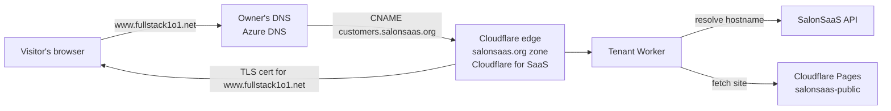
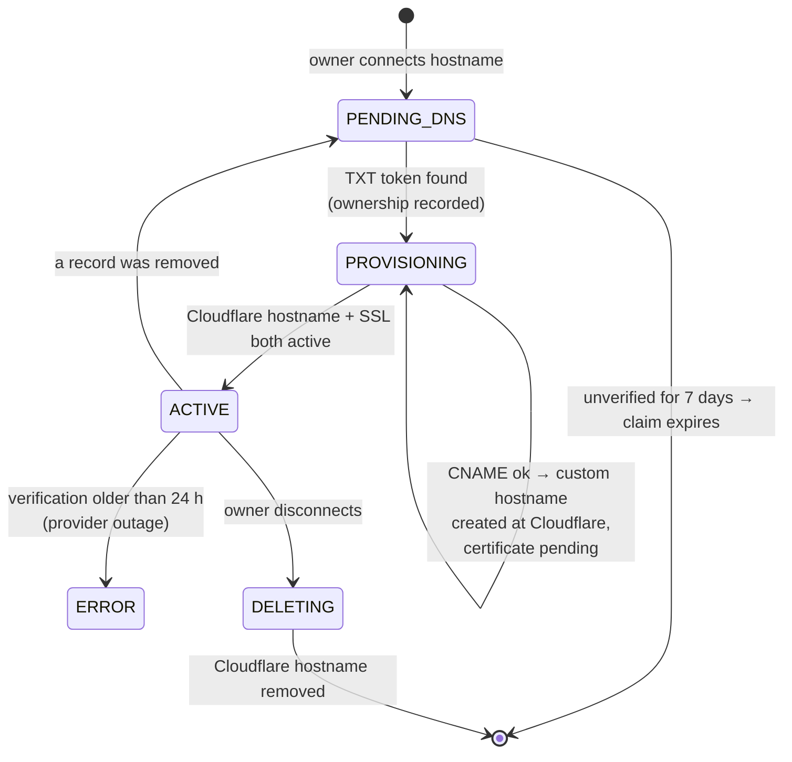
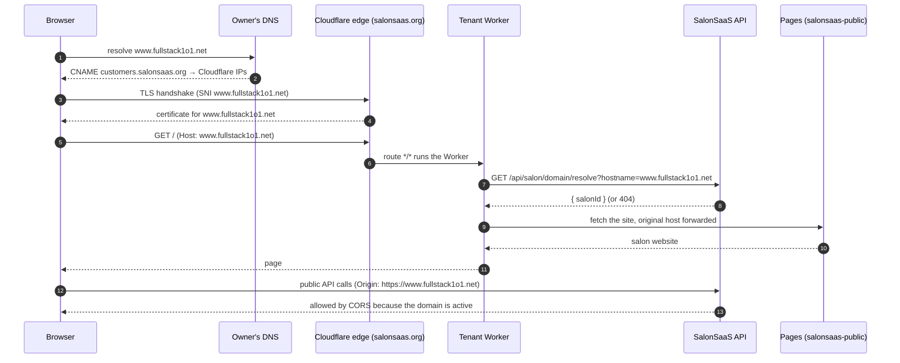

# How customer website domains work — a walkthrough

A salon's website is always reachable at its included address, `https://<handler>.salonsaas.org`.
With **Domains** (Admin → Website → Domains) the owner can also serve it from a hostname they
own, for example `https://www.fullstack1o1.net`, without moving their domain, registrar or DNS
provider to us.

This page explains the whole flow end to end, at a reading pace. For the setup checklist,
environment variables and rollout/rollback steps see [custom-domains.md](custom-domains.md).

**Contents**

1. [The three players](#1-the-three-players)
2. [Part A — one-time platform setup](#part-a--one-time-platform-setup)
3. [Part B — a salon connects a domain](#part-b--a-salon-connects-a-domain)
4. [Part C — a visitor opens the custom domain](#part-c--a-visitor-opens-the-custom-domain)
5. [Part D — while connected, and disconnecting](#part-d--while-connected-and-disconnecting)
6. [Why `www` and not the bare domain](#why-www-and-not-the-bare-domain)
7. [Troubleshooting](#troubleshooting)
8. [Where things live in the code](#where-things-live-in-the-code)

---

## 1. The three players

| Player | What it does in this flow |
|---|---|
| **The owner's DNS provider** (e.g. Azure DNS for `fullstack1o1.net`) | Keeps the domain. The owner adds **two records** there — nothing else changes. |
| **Cloudflare — the `salonsaas.org` zone with Cloudflare for SaaS** | Receives the traffic for the custom hostname, issues its TLS certificate, and runs our Worker. |
| **SalonSaaS API** (`api.salonsaas.org`) | Checks ownership, registers the hostname with Cloudflare, and answers "which salon owns this hostname?". |



---

## Part A — one-time platform setup

This is already done for the `mix` environment. It happens once, not per salon.

### A1. Enable Cloudflare for SaaS

In the Cloudflare dashboard: **salonsaas.org zone → SSL/TLS → Custom Hostnames → Enable**.

This lets our zone accept traffic — and issue certificates — for hostnames it does **not** own,
such as `www.fullstack1o1.net`. Cloudflare calls each of these a *custom hostname*. The free
allowance is 100 custom hostnames; more are billed.

### A2. Terraform creates the "landing spot"

`infrastructure/mix` (module `tenant_wildcard`, when `website_domains_enabled = true`) creates:

| Resource | Why |
|---|---|
| DNS record **`customers.salonsaas.org`** → `AAAA 100::`, **proxied** | The single target every salon's CNAME points at. `100::` is a *discard* address: there is no server behind it. Cloudflare's edge answers everything. |
| **Fallback origin** = `customers.salonsaas.org` | Tells Cloudflare for SaaS where custom-hostname traffic goes by default. |
| **Worker route `*/*`** | Makes the tenant Worker run for *any* hostname arriving at the zone, including custom hostnames. |
| **Bypass routes** (no Worker) | Keep `salonsaas.org` (marketing), `admin.`, `book.`, `dashboard.`, `staff.`, `super-admin.`, `api.` and `auth.` off the Worker. |

Why the name `customers`? It's only a readable label — any unused name in the zone would work.
It's configurable as `WEBSITE_DOMAINS_CNAME_TARGET`, but changing it later forces every
connected salon to update their CNAME, so pick it once and leave it.

### A3. Give the API a narrow Cloudflare token

A **separate** API token with a single permission — *Zone → SSL and Certificates → Edit* on
`salonsaas.org` only — is injected into the API as `WEBSITE_DOMAINS_API_TOKEN`, together with
`WEBSITE_DOMAINS_ENABLED=true`, `WEBSITE_DOMAINS_ZONE_ID` and `WEBSITE_DOMAINS_CNAME_TARGET`.

The token can only list / create / read / delete custom hostnames. It can't edit DNS, so a leak
can't redirect our own hosts. The Terraform token is never given to the running app.

Because domain checks run in the background, the API keeps **at least one replica** running
while the feature is enabled (it no longer scales to zero).

---

## Part B — a salon connects a domain

### B1. The owner enters a hostname

Admin → Website → Domains → `www.fullstack1o1.net` → **Connect domain**.

The API then:

1. **Normalizes and validates** — lowercase, international names converted (`müller.dk` →
   `xn--mller-kva.dk`), no `https://`, port, path, IP address or `*.salonsaas.org`.
2. **Looks up the DNS zone** with one DNS-over-HTTPS query (`SOA`):
   - an SOA answer for the *exact* name means it's a zone root such as `fullstack1o1.net` →
     **rejected** with a message suggesting `www.fullstack1o1.net` (see [below](#why-www-and-not-the-bare-domain));
   - otherwise the answer's *authority* section names the zone (`fullstack1o1.net`), which is
     stored so the admin can show record names the way DNS providers expect them.
3. **Saves a claim** — status `PENDING_DNS` with a random **ownership token**.

It does **not** call Cloudflare yet: nobody has proven they own the domain.

Rules enforced by the database: one domain per salon, and a hostname can belong to one salon only.

### B2. The owner adds two records at their DNS provider

The admin shows:

| Type | Name (as typed at most providers) | Value | Purpose |
|---|---|---|---|
| TXT | `_salonsaas-verification.www` | the ownership token | **Proves ownership** — only whoever controls the DNS can publish it. |
| CNAME | `www` | `customers.salonsaas.org` | **Routes traffic** for the hostname to Cloudflare's edge. |

Two important details:

- **Type the short name.** Azure DNS, GoDaddy, Cloudflare and most others append the zone
  (`.fullstack1o1.net`) to the Name field. The admin shows the short name to type and the full
  name underneath for the few providers that want it.
- **DNS-only.** If the owner's provider offers proxying/CDN (e.g. their *own* Cloudflare
  account's orange cloud), turn it off for this CNAME — the check needs to see a direct CNAME to
  `customers.salonsaas.org`.

Keep both records in place for as long as the domain is connected: they're re-checked regularly.

### B3. The checks run

A background job runs every **60 seconds** and checks each domain at most every **5 minutes**.
**Check connection** runs a check immediately (30-second cooldown between manual checks). Each
round takes the connection one step further:



In detail:

1. **Ownership (TXT).** The API looks up `_salonsaas-verification.www.fullstack1o1.net` via
   DNS-over-HTTPS (`cloudflare-dns.com`). If the token matches, it records "verified" in the
   database **before** calling Cloudflare — so a crash can never leave a Cloudflare hostname we
   don't know about.
2. **Routing (CNAME).** `www.fullstack1o1.net` must be a CNAME to exactly `customers.salonsaas.org`.
3. **Register with Cloudflare.** `POST /zones/{zone}/custom_hostnames` with
   `{ hostname, ssl: { method: "http", type: "dv", settings: { min_tls_version: "1.2" } } }`.
   If an earlier attempt was interrupted, the API first searches for the exact hostname and
   reuses it instead of creating a duplicate.
4. **Certificate.** Cloudflare validates the hostname over HTTP. This happens automatically:
   the CNAME already sends the hostname's traffic to Cloudflare, so Cloudflare can answer its
   own validation request. It then issues a certificate for `www.fullstack1o1.net`.
5. **Active.** When Cloudflare reports both the hostname *and* the SSL certificate as `active`,
   the connection becomes `ACTIVE`, valid for **24 hours** and renewed by every successful check.

Provisioning usually needs a few rounds (minutes, sometimes longer while DNS propagates).

---

## Part C — a visitor opens the custom domain



1. **DNS.** The browser follows the CNAME to Cloudflare's edge.
2. **TLS.** Cloudflare matches the name in the handshake to the custom hostname in our zone and
   presents its certificate.
3. **Worker.** The `*/*` route runs the tenant Worker. The host isn't `<handler>.salonsaas.org`,
   so the Worker asks the API which salon owns it.
4. **Resolve.** `/api/salon/domain/resolve` returns the salon only when the connection is
   `ACTIVE`, verified within the last 24 hours, and the salon is active with its website
   feature on. Anything else → `404` and the Worker serves nothing (**fail closed**). Nothing is
   cached by the Worker or the API, so a disconnect takes effect immediately.
5. **Serve.** The Worker fetches the salon website from Cloudflare Pages and passes the original
   host along; the website recognises the custom host and loads that salon.
6. **API calls from the page.** The website calls `api.salonsaas.org`. CORS admits
   `https://www.fullstack1o1.net` **only** for public paths (`/api/salon/**`,
   `/api/salon-utility/**`, analytics) and only while the domain is active. Admin endpoints
   never accept it, and CORS never replaces authorization.
7. **Payments.** Shop and booking checkouts send the current page as `returnUrl`. The API accepts
   it because it's this salon's active domain, so Stripe returns the customer to
   `www.fullstack1o1.net` after paying (see [stripe-connect.md](stripe-connect.md)).

Throughout, the included address `https://<handler>.salonsaas.org` keeps working. Admin
share/live links and the website's canonical link prefer the connected domain.

---

## Part D — while connected, and disconnecting

**Ongoing checks.** Every 5 minutes both records and Cloudflare's status are re-checked:

| Situation | Result |
|---|---|
| Owner removes the TXT or CNAME record | Back to `PENDING_DNS`; the domain stops serving. |
| Cloudflare or DNS lookups temporarily fail | Keeps serving on its last success for **up to 24 hours**, then stops until it can be verified again. |
| Salon disabled, or website feature turned off | Stops resolving immediately (even if Cloudflare still has the hostname). Re-enabling allows it again. |
| Claim never verified | Removed after **7 days**. |

**Disconnect** (Admin → Domains → Disconnect):

1. The connection is set to `DELETING` straight away — it stops resolving and loses CORS access
   in the same moment.
2. The background job deletes the custom hostname at Cloudflare, retrying until it succeeds,
   then removes the row. Until then the hostname stays reserved.
3. Reconnecting later issues a **new** ownership token, so the TXT record must be updated.

The owner should then remove the two records from their DNS.

---

## Why `www` and not the bare domain

The routing step needs a **CNAME**. A zone's root (`fullstack1o1.net`) already holds the zone's
NS and SOA records, and DNS doesn't allow a CNAME next to other records — Azure DNS won't even
let you create one at `@`. Some providers fake it ("CNAME flattening", ALIAS records), but those
publish A/AAAA records instead of a CNAME, so the check can't see where they point.

So: connect `www.yourdomain`, and redirect the bare domain to it at the owner's DNS or hosting
provider. The admin rejects bare domains up front instead of leaving them stuck on
"Waiting for DNS".

### What the owner is told

Where the domain lives is the owner's choice, so the platform doesn't host the redirect — it
explains it. When the connected hostname is `www.<zone>`, the Domains section shows a
**"Make `<zone>` work too"** panel with:

1. Use the provider's *domain forwarding* / *URL redirect* / *redirect rule* feature.
2. Forward `<zone>` → `https://www.<zone>` as a **permanent (301)** redirect, keeping path and
   query, with HTTPS on the bare domain if offered.
3. Leave the `www` records alone and don't add a CNAME for the bare domain.
4. Test `http://<zone>` and `https://<zone>` — both should land on `https://www.<zone>`.

It also has short tips for common providers:

| Provider | How to redirect the bare domain |
|---|---|
| Cloudflare DNS | `A @ → 192.0.2.1` **proxied**, plus a Redirect Rule to `https://www.<zone>` (301). Keep the `www` CNAME *DNS only*. |
| GoDaddy, Namecheap, one.com, most registrars | *Domain forwarding* / *URL redirect* (usually needs the registrar's nameservers). |
| Azure DNS | No redirect feature: alias record at `@` to an Azure service that redirects (e.g. a Front Door rule), or manage DNS where forwarding exists. |
| AWS Route 53 | Alias at `@` to an S3 bucket set to redirect (CloudFront for HTTPS). |

The platform doesn't check whether the redirect works: that would mean our servers fetching a
customer-controlled URL, which the domain design deliberately avoids.

Serving the bare domain directly would need either Cloudflare for SaaS *apex proxying*
(Enterprise add-on, fixed IPs for A records) or accepting CNAME-flattened/ALIAS records from
providers that support them to external names — neither is implemented.

---

## Troubleshooting

### Stuck on "Waiting for DNS"

Check what public DNS actually returns (the same resolver the API uses):

```sh
curl -s -H 'accept: application/dns-json' \
  'https://cloudflare-dns.com/dns-query?name=_salonsaas-verification.www.fullstack1o1.net&type=TXT'
curl -s -H 'accept: application/dns-json' \
  'https://cloudflare-dns.com/dns-query?name=www.fullstack1o1.net&type=CNAME'
```

Common causes:

- **Full name typed at a provider that appends the zone.** Typing
  `_salonsaas-verification.www.fullstack1o1.net` in Azure DNS creates
  `_salonsaas-verification.www.fullstack1o1.net.fullstack1o1.net`. Query that doubled name — if
  it has the value, delete the record and re-add it with the short name shown in the admin.
- **The TXT value doesn't match.** After a disconnect/reconnect the token changes; copy the
  current one.
- **The CNAME is proxied/flattened** by the owner's provider — switch it to DNS-only.
- **DNS hasn't propagated yet.** Use a low TTL (e.g. 300) while setting up, then wait a few
  minutes and **Check connection** again (30-second cooldown).

### Stuck on "Preparing HTTPS"

Ownership and CNAME are fine; Cloudflare is issuing the certificate. Check **Cloudflare →
salonsaas.org → SSL/TLS → Custom Hostnames** for the hostname's certificate status. If it
doesn't progress, confirm the CNAME still points at `customers.salonsaas.org` and that the
fallback origin shows **Active**.

### "Needs attention"

A check hit an error (e.g. a Cloudflare or DNS outage). It retries automatically; details are in
the API logs as `Domain check failed for <id> (<ExceptionType>)`. An active domain keeps serving
for up to 24 hours during an outage.

### The site opens but shows nothing / the wrong thing

- Confirm resolve works: `curl https://api.salonsaas.org/api/salon/domain/resolve?hostname=www.fullstack1o1.net`
  — `404` means the connection isn't active, or the salon or its website feature is disabled.
- Confirm the salon's website feature is enabled and the salon is active.

---

## Where things live in the code

| Concern | Location |
|---|---|
| Admin UI (connect, records, check, disconnect) | `frontend/apps/salon-admin/app/components/WebsiteDomains.tsx` |
| Hostname validation | `website/internal/DomainHostname.java` |
| Connect, checks, state machine, zone lookup | `website/internal/WebsiteDomainService.java` |
| DNS-over-HTTPS client (`cloudflare-dns.com`) | `website/internal/DomainDnsClient.java` |
| Cloudflare custom hostnames client | `website/internal/CloudflareHostnameClient.java` |
| Storage | `website_domain` table — `db/V11__website_domains.sql`, `db/V13__website_domain_zone.sql` |
| Public resolve + CORS | `WebsiteDomainController` (`/api/salon/domain/resolve`), `WebsiteCorsConfiguration.java` |
| Stripe return to the custom domain | `payments/internal/StripeConnectService.returnPage` |
| Worker + Cloudflare resources | `infrastructure/mix/stacks/tenant-wildcard/` (`worker.js.tftpl`, `main.tf`) |
| Platform wiring (env, token, replicas) | `infrastructure/mix/environments/mix/main.tf` |

Java paths are under `src/main/java/net/samitkumar/multi_tenant_salon/`.
